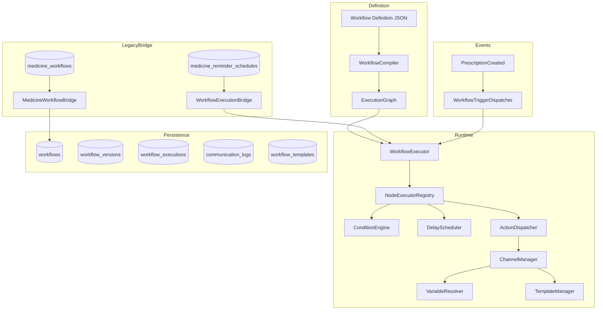
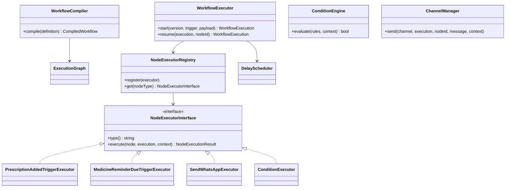

# Workflow Runtime Architecture

This document describes the generic Workflow Platform introduced under `app/Modules/Workflow/`. Medicine Reminder is the first workflow implementation and continues to expose its existing API while executing through the generic runtime internally.

## High-Level Architecture



## Folder Structure

```
app/Modules/Workflow/
├── Contracts/
│   ├── NodeExecutorInterface.php
│   └── WorkflowCompilerInterface.php
├── DTO/
│   ├── CompiledWorkflow.php
│   ├── ExecutionEdge.php
│   ├── ExecutionGraph.php
│   ├── ExecutionNode.php
│   ├── NodeExecutionResult.php
│   └── WorkflowContext.php
├── Enums/
│   ├── ActionCategory.php
│   ├── CommunicationStatus.php
│   ├── NodeType.php
│   └── WorkflowExecutionStatus.php
├── Events/
│   ├── AppointmentBooked.php
│   ├── BirthdayReached.php
│   ├── LabReportReady.php
│   ├── MedicineReminderDue.php
│   ├── PaymentReceived.php
│   └── PrescriptionAdded.php
├── Executors/
│   ├── AbstractNodeExecutor.php
│   ├── Actions/          # sendWhatsApp, sendEmail, sendPush, sendSMS, webhook, database
│   ├── Flow/             # condition, delay, end
│   └── Triggers/         # prescriptionAdded, medicineReminderDue, medicineReminder (legacy)
├── Jobs/
│   └── ContinueWorkflowExecutionJob.php
├── Listeners/
│   └── StartWorkflowOnPrescriptionAdded.php
├── Models/
│   ├── CommunicationLog.php
│   ├── Workflow.php
│   ├── WorkflowExecution.php
│   ├── WorkflowTemplate.php
│   └── WorkflowVersion.php
├── Repositories/
│   └── WorkflowRepository.php
├── Services/
│   ├── Bridge/
│   │   ├── MedicineWorkflowBridge.php
│   │   └── WorkflowExecutionBridge.php
│   ├── Compiler/
│   │   └── WorkflowCompiler.php
│   └── Runtime/
│       ├── ActionDispatcher.php
│       ├── ChannelManager.php
│       ├── ConditionEngine.php
│       ├── DelayScheduler.php
│       ├── NodeExecutorRegistry.php
│       ├── TemplateManager.php
│       ├── VariableResolver.php
│       ├── WorkflowExecutor.php
│       └── WorkflowTriggerDispatcher.php
├── Support/
│   └── NodeTypeNormalizer.php
└── WorkflowServiceProvider.php
```

## Class Diagram (Core)



## Execution Flow

### Prescription Added (Schedule Creation)

1. `PrescriptionService` fires `PrescriptionCreated`
2. `CreateMedicineReminderSchedules` listener syncs `medicine_workflows` → `workflows` via `MedicineWorkflowBridge`
3. `WorkflowTriggerDispatcher` finds active workflows with `prescriptionAdded` trigger
4. `WorkflowExecutor::start()` compiles the pinned `workflow_version` and traverses the graph
5. `PrescriptionAddedTriggerExecutor` (or legacy `medicineReminder` node) calls `MedicineReminderService::createSchedulesForPrescription()`
6. Schedules are written to `medicine_reminder_schedules` (unchanged table)

### Medicine Reminder Due (Notification Dispatch)

1. `medicine-reminders:dispatch` command claims due schedules
2. `SendMedicineReminderJob` invokes `MedicineReminderExecutionService`
3. `WorkflowExecutionBridge` syncs workflow version and starts execution with `medicineReminderDue` context
4. `MedicineReminderDueTriggerExecutor` resolves template variables and sends via `ChannelManager`
5. Delivery is logged in `communication_logs` and legacy `medicine_notification_logs`

## Database Tables

| Table | Purpose | Reuses Legacy |
|-------|---------|---------------|
| `workflows` | Generic workflow registry | Bridges from `medicine_workflows` via `source_type/source_id` |
| `workflow_versions` | Immutable published definitions | New — every publish creates a version |
| `workflow_executions` | Runtime state | New |
| `communication_logs` | Cross-channel delivery audit | Complements `medicine_notification_logs` |
| `workflow_templates` | Channel templates outside JSON | New |
| `medicine_workflows` | Existing builder storage | **Retained** |
| `medicine_reminder_schedules` | Time-based schedules | **Retained** |

## Migration Plan: Old → New

| Old Component | New Component | Status |
|---------------|---------------|--------|
| `MedicineReminderService` (schedule creation) | `PrescriptionAddedTriggerExecutor` | Wired via `WorkflowExecutor` |
| `MedicineReminderExecutionService` | `WorkflowExecutionBridge` + `MedicineReminderDueTriggerExecutor` | Wired |
| `NotificationDispatcher` | `ChannelManager` + `ActionDispatcher` | ChannelManager wraps existing notification services |
| `VariableResolverService` | `VariableResolver` | Generic resolver with legacy variable keys |
| `SendMedicineReminderJob` | Unchanged entry point → delegates to workflow runtime | Backward compatible |
| `CreateMedicineReminderSchedules` | Routes through `WorkflowTriggerDispatcher` | Backward compatible listener name |
| Workflow JSON in `medicine_workflows.configuration` | Compiled by `WorkflowCompiler` | Same JSON contract as frontend |

## Node Executor Registry

| Node Type | Executor |
|-----------|----------|
| `prescriptionAdded` | PrescriptionAddedTriggerExecutor |
| `medicineReminderDue` | MedicineReminderDueTriggerExecutor |
| `medicineReminder` | MedicineReminderNodeExecutor (legacy builder node) |
| `appointmentBooked` | AppointmentBookedTriggerExecutor |
| `birthday` | BirthdayTriggerExecutor |
| `scheduledEvent` | ScheduledEventTriggerExecutor |
| `condition` | ConditionExecutor |
| `delay` | DelayExecutor |
| `end` | EndExecutor |
| `sendWhatsApp` | SendWhatsAppExecutor |
| `sendEmail` | SendEmailExecutor |
| `sendPush` | SendPushExecutor |
| `sendSMS` | SendSMSExecutor |
| `webhook` | WebhookExecutor |
| `databaseUpdate` | UpdateRecordExecutor |
| `createRecord` | CreateRecordExecutor |

## Versioning Rules

- Publishing a workflow creates a new row in `workflow_versions` (never overwrites)
- `workflows.current_version_id` points to the latest published version
- `workflow_executions.workflow_version_id` pins the version used at start time
- Running executions continue on their pinned version even if a newer version is published

## Next Steps (Incremental)

1. Migrate existing `medicine_workflows` rows into `workflows` via artisan sync command
2. Move inline message templates from workflow JSON into `workflow_templates`
3. Replace schedule pre-computation with pure `delay` nodes where graphs support it
4. Add API controllers under `app/Modules/Workflow/Controllers` for generic workflow CRUD
5. Wire additional domain events (`AppointmentBooked`, `PaymentReceived`, etc.) to `WorkflowTriggerDispatcher`

## Operations

```bash
php artisan migrate
php artisan queue:work
php artisan schedule:work
php artisan medicine-reminders:dispatch
```
