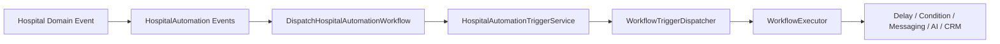
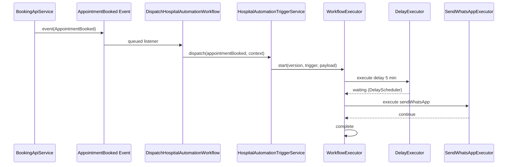

# Hospital Automation Modules

Real hospital CRM automations built on the **existing Workflow Runtime**. No module bypasses `WorkflowExecutor`.

## Architecture



## Modules

| # | Module | Triggers |
|---|--------|----------|
| 1 | Appointment | `appointmentBooked`, `appointmentCancelled`, `appointmentMissed`, `appointmentRescheduled`, `appointmentCompleted` |
| 2 | Lab | `labTestOrdered`, `labReportReady`, `labCompleted` |
| 3 | Pharmacy | `prescriptionAdded`, `medicineRefillDue` |
| 4 | Billing | `invoiceGenerated`, `paymentReceived`, `paymentPending` |
| 5 | Membership | `membershipExpiry`, `membershipRenewed`, `rewardPointsUpdated`, `rewardTierUpgraded` |
| 6 | Engagement | `birthday`, `anniversaryReached`, `patientRegistered` |
| 7 | Feedback | `appointmentCompleted`, `procedureCompleted`, `labCompleted` |
| 8 | Chat | `messageReceived` |
| 9 | AI | `aiPrompt` action node |
| 10 | Campaign | `campaignTriggered` |

## Folder Structure

```
app/Modules/HospitalAutomation/
├── Contracts/HospitalAutomationEvent.php
├── Controllers/HospitalAutomationController.php
├── Events/                    # Domain events per module
├── Executors/
│   ├── HospitalDomainTriggerExecutor.php
│   └── AiPromptExecutor.php
├── Listeners/DispatchHospitalAutomationWorkflow.php
├── Routes/hospitalAutomation.php
├── Services/
│   ├── AutomationContextBuilder.php
│   └── HospitalAutomationTriggerService.php
├── Support/TriggerCatalog.php
└── HospitalAutomationServiceProvider.php
```

## Event → Trigger Mapping

| Domain Event | Workflow Trigger |
|--------------|------------------|
| `AppointmentBooked` | `appointmentBooked` |
| `AppointmentCancelled` | `appointmentCancelled` |
| `AppointmentCompleted` | `appointmentCompleted` |
| `LabReportReady` | `labReportReady` |
| `InvoiceGenerated` | `invoiceGenerated` |
| `PaymentReceived` | `paymentReceived` |
| `BirthdayReached` | `birthday` |
| `CampaignTriggered` | `campaignTriggered` |

Full catalog: `GET /api/hospital-automation/catalog`

## Domain Hooks (Wired)

| Location | Event Fired |
|----------|-------------|
| `BookingApiService` | `AppointmentBooked` on booking create |
| `DoctorBookingStatusService` | `AppointmentBooked`, `AppointmentCancelled`, `AppointmentCompleted` on status change |

## API Endpoints

### Builder Connect (React Flow UI)

Primary CRUD + publish + builder metadata APIs for the workflow builder UI. See **[Builder Connect API](BUILDER_CONNECT.md)** for full request/response contracts.

| Method | Path | Description |
|--------|------|-------------|
| GET/POST/PUT/DELETE | `/api/workflows` | Workflow CRUD |
| POST | `/api/workflows/{id}/publish` | Publish draft |
| GET | `/api/workflow/triggers` | Trigger schemas for properties panel |
| GET | `/api/workflow/variables` | Variable picker |
| GET | `/api/workflow/templates` | Template list |
| GET | `/api/workflow/executions` | Execution log |

### Hospital Automation (legacy read / ops)

| Method | Path | Description |
|--------|------|-------------|
| GET | `/api/hospital-automation/catalog` | Module + trigger catalog |
| GET | `/api/hospital-automation/workflows` | Active automation workflows |
| GET | `/api/hospital-automation/executions` | Execution search |
| GET | `/api/hospital-automation/templates` | Communication templates |
| POST | `/api/hospital-automation/trigger` | Manual trigger (testing) |

### Manual Trigger Example

```json
POST /api/hospital-automation/trigger
{
  "trigger_type": "labReportReady",
  "payload": {
    "patient_id": "123",
    "lab_test_name": "CBC",
    "organization_id": 1
  }
}
```

## Seeders

```bash
php artisan db:seed --class=HospitalAutomationTemplateSeeder
php artisan db:seed --class=HospitalAutomationWorkflowSeeder
```

- **Templates** → `workflow_templates` (WhatsApp, SMS, Email, Push, AI)
- **Workflows** → `workflows` + `workflow_versions` with sample React Flow JSON

## Variables

Extended in `VariableResolver` (runtime):

`PatientName`, `DoctorName`, `HospitalName`, `AppointmentDate`, `AppointmentTime`, `InvoiceAmount`, `LabTestName`, `MembershipTier`, `CouponCode`, `FeedbackUrl`, `AiSummary`

## Testing Plan

1. **Catalog** — `GET /api/hospital-automation/catalog` returns 10 modules
2. **Seed** — run template + workflow seeders; verify `workflows` rows
3. **Appointment Booked** — create doctor booking → verify `workflow_executions` row
4. **Manual Trigger** — POST `labReportReady` → execution completes through graph
5. **Delay Node** — appointment workflow waits 5 min then sends WhatsApp (queue worker required)
6. **Condition Node** — lab workflow branches on condition handle
7. **AI Node** — lab AI workflow sets `ai_summary` variable
8. **Templates** — messages resolve `{{PatientName}}` etc. from context
9. **No Bypass** — confirm no module-specific schedulers exist
10. **Backward Compat** — Medicine Reminder still works via `prescriptionAdded`

## Implementation Rules (Enforced)

- All automations dispatch through `WorkflowTriggerDispatcher` → `WorkflowExecutor`
- Delays use `DelayScheduler` / `DelayExecutor`
- Conditions use `ConditionEngine` / `ConditionExecutor`
- Messaging uses `ChannelManager` + `workflow_templates`
- No module-specific schedulers or bypass paths

## Sequence: Appointment Booked


