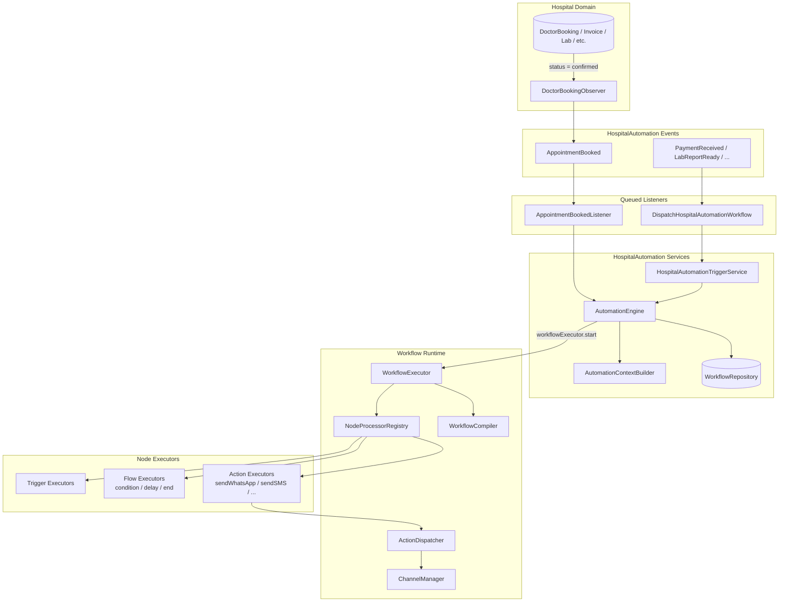
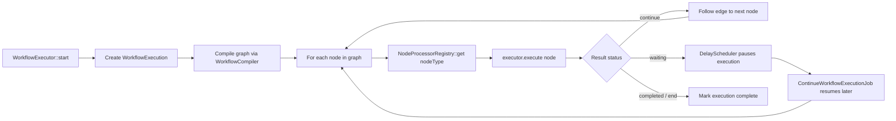
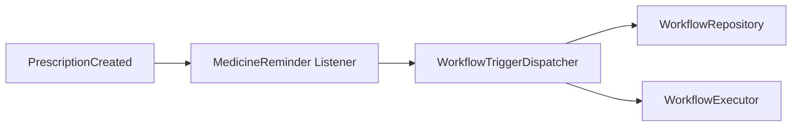

# HIP Modules Architecture — Events, Triggers, AutomationEngine & Workflow Runtime

This document explains how the modules under `app/Modules/` work together, with a focus on **HospitalAutomation** and **Workflow**, and how everything connects to `AutomationEngine`.

---

## 1. High-Level Overview

HIP automation is split into two cooperating layers:


| Layer             | Module               | Responsibility                                                                         |
| ----------------- | -------------------- | -------------------------------------------------------------------------------------- |
| **Orchestration** | `HospitalAutomation` | Detect hospital domain events, build context, find matching workflows, start execution |
| **Execution**     | `Workflow`           | Compile workflow graphs, walk nodes, run triggers/actions/flow steps                   |


**Key rule:** `HospitalAutomation` does **not** execute workflow nodes directly. It always hands off to `WorkflowExecutor`.

```
Domain change → Event → Listener → AutomationEngine → WorkflowExecutor → NodeProcessorRegistry → Executors → Actions/Channels
```

---


## 2. Module Map (`app/Modules/`)

```
app/Modules/
├── HospitalAutomation/     # Hospital CRM automations (events, context, orchestration)
├── Workflow/               # Generic workflow runtime (builder, compiler, executors)
└── MedicineReminder/       # Medicine schedules; can also trigger workflows directly
```


### Bootstrap order (`bootstrap/providers.php`)

1. `WorkflowServiceProvider` — registers `NodeProcessorRegistry` and all core executors
2. `HospitalAutomationServiceProvider` — wires events/listeners/observers; adds `AiPromptNodeProcessor`
3. `MedicineReminderServiceProvider` — prescription → reminder schedules / workflow bridge

---


## 3. End-to-End Flow Diagram


### 3.1 Main path (Hospital Automation → AutomationEngine)




### 3.2 Node execution loop (inside WorkflowExecutor)




### 3.3 Alternate entry (bypasses AutomationEngine)

Some flows (e.g. prescription/medicine) can call `WorkflowTriggerDispatcher` directly:




This path is lighter: no context enrichment, no duplicate guard, no hospital-specific filtering.

---


## 4. How `AutomationEngine` Connects to Everything

**File:** `app/Modules/HospitalAutomation/Services/AutomationEngine.php`

`AutomationEngine` is the **bridge** between hospital domain events and the workflow runtime.

### What it does


| Step | Action                                    | Connected file                                                         |
| ---- | ----------------------------------------- | ---------------------------------------------------------------------- |
| 1    | Normalize trigger type                    | `app/Modules/Workflow/Support/NodeTypeNormalizer.php`                  |
| 2    | Build execution context                   | `app/Modules/HospitalAutomation/Services/AutomationContextBuilder.php` |
| 3    | Resolve `organization_id` / `hospital_id` | From booking/payload/context                                           |
| 4    | Find published workflows                  | `app/Modules/Workflow/Repositories/WorkflowRepository.php`             |
| 5    | Prevent duplicate runs                    | `app/Modules/Workflow/Models/WorkflowExecution.php`                    |
| 6    | Start workflow                            | `app/Modules/Workflow/Services/Runtime/WorkflowExecutor.php`           |


### Constructor dependencies

```php
AutomationEngine(
    AutomationContextBuilder $contextBuilder,
    WorkflowRepository $workflowRepository,
    WorkflowExecutor $workflowExecutor,
)
```


### What AutomationEngine adds vs WorkflowTriggerDispatcher


| Feature                                  | AutomationEngine                | WorkflowTriggerDispatcher       |
| ---------------------------------------- | ------------------------------- | ------------------------------- |
| Context enrichment                       | Yes                             | No                              |
| Hospital scoping for `appointmentBooked` | Yes                             | Optional param only             |
| Duplicate execution guard                | Yes                             | No                              |
| Node execution                           | Delegates to `WorkflowExecutor` | Delegates to `WorkflowExecutor` |


**WorkflowTriggerDispatcher file:** `app/Modules/Workflow/Services/Runtime/WorkflowTriggerDispatcher.php`

---


## 5. Events → Listeners → Services


### Registration

**File:** `app/Modules/HospitalAutomation/HospitalAutomationServiceProvider.php`


| Event                        | Listener                             | Calls                                                                         |
| ---------------------------- | ------------------------------------ | ----------------------------------------------------------------------------- |
| `AppointmentBooked`          | `AppointmentBookedListener`          | `AutomationEngine::handle()` directly                                         |
| All other 20 hospital events | `DispatchHospitalAutomationWorkflow` | `HospitalAutomationTriggerService::dispatch()` → `AutomationEngine::handle()` |


### Example: Appointment Booked (special path)


| Step                                | File                                                                     |
| ----------------------------------- | ------------------------------------------------------------------------ |
| Observer watches `DoctorBooking`    | `app/Modules/HospitalAutomation/Observers/DoctorBookingObserver.php`     |
| Fires event when status = confirmed | `app/Modules/HospitalAutomation/Events/AppointmentBooked.php`            |
| Queued listener reloads booking     | `app/Modules/HospitalAutomation/Listeners/AppointmentBookedListener.php` |
| Starts automation                   | `app/Modules/HospitalAutomation/Services/AutomationEngine.php`           |


### Generic event contract

**File:** `app/Modules/HospitalAutomation/Contracts/HospitalAutomationEvent.php`

Every hospital automation event implements:

- `triggerType(): string` — e.g. `appointmentBooked`, `paymentReceived`
- `payload(): array` — data passed into workflow context


### Manual/API trigger

**File:** `app/Modules/HospitalAutomation/Controllers/HospitalAutomationController.php`  
**Route file:** `app/Modules/HospitalAutomation/Routes/hospitalAutomation.php`

```
POST /api/hospital-automation/trigger
  → HospitalAutomationTriggerService::dispatch()
  → AutomationEngine::handle()
```

---


## 6. Triggers

Triggers are the **start nodes** of a workflow graph. They represent *what happened* in the hospital system.

### Trigger catalog

**File:** `app/Modules/HospitalAutomation/Support/TriggerCatalog.php`


| Module      | Trigger types                                                                                                                             |
| ----------- | ----------------------------------------------------------------------------------------------------------------------------------------- |
| Appointment | `appointmentBooked`, `appointmentCancelled`, `appointmentMissed`, `appointmentRescheduled`, `appointmentCompleted`, `appointmentReminder` |
| Lab         | `labTestOrdered`, `labReportReady`, `labCompleted`                                                                                        |
| Pharmacy    | `prescriptionAdded`, `medicineReminderDue`, `medicineRefillDue`                                                                           |
| Billing     | `invoiceGenerated`, `paymentReceived`, `paymentPending`                                                                                   |
| Membership  | `membershipExpiry`, `membershipRenewed`, `rewardPointsUpdated`, `rewardTierUpgraded`, ...                                                 |
| Engagement  | `birthday`, `anniversaryReached`, `patientRegistered`                                                                                     |
| Feedback    | `procedureCompleted`                                                                                                                      |
| Chat        | `messageReceived`                                                                                                                         |
| Integration | `webhookEvent`, `apiEvent`, `scheduledEvent`                                                                                              |
| Campaign    | `campaignTriggered`                                                                                                                       |


### Hospital domain events (event classes)

**Folder:** `app/Modules/HospitalAutomation/Events/`

Examples:

- `AppointmentBooked.php`
- `AppointmentCancelled.php`
- `PaymentReceived.php`
- `LabReportReady.php`
- `MedicineRefillDue.php`
- `BirthdayReached.php`
- ... (21 events total)

---


## 7. Nodes, Executors, Actions & Flow

Workflow graphs are made of **nodes**. Each node type has a matching **executor** registered in `NodeProcessorRegistry`.

### Node categories

**Enum file:** `app/Modules/Workflow/Enums/NodeType.php`


| Category    | Node types                                                                                                                              | Purpose                            |
| ----------- | --------------------------------------------------------------------------------------------------------------------------------------- | ---------------------------------- |
| **Trigger** | All `TriggerCatalog` types                                                                                                              | Start the workflow; enrich context |
| **Flow**    | `condition`, `delay`, `end`                                                                                                             | Branching, waiting, termination    |
| **Action**  | `sendWhatsApp`, `sendEmail`, `sendSMS`, `sendPush`, `sendTemplate`, `webhook`, `databaseUpdate`, `createRecord`, `dbDelete`, `aiPrompt` | Side effects                       |


### Executor registry

**File:** `app/Modules/Workflow/NodeProcessorRegistry.php`  
**Registered in:** `app/Modules/Workflow/WorkflowServiceProvider.php`

```php
NodeProcessorRegistry
  → register(SendWhatsAppNodeProcessor)
  → register(ConditionNodeProcessor)
  → register(AppointmentBookedTriggerNodeProcessor)
  → register(TriggerNodeProcessor) // for any catalog type without a specialized executor
```


### Trigger executors

**Folder:** `app/Modules/Workflow/NodeProcessors/`


| File                                     | `type()`              | Notes                                     |
| ---------------------------------------- | --------------------- | ----------------------------------------- |
| `AppointmentBookedTriggerNodeProcessor.php`   | `appointmentBooked`   | Specialized; enriches appointment context |
| `PrescriptionAddedTriggerNodeProcessor.php`   | `prescriptionAdded`   | Pharmacy flow                             |
| `MedicineReminderDueTriggerNodeProcessor.php` | `medicineReminderDue` | Reminder trigger                          |
| `BirthdayTriggerNodeProcessor.php`            | `birthday`            | Engagement                                |
| `ScheduledEventTriggerNodeProcessor.php`      | `scheduledEvent`      | Cron/scheduled                            |
| `TriggerNodeProcessor.php`         | *dynamic*             | Default for all other catalog triggers    |
| `MedicineReminderNodeProcessor.php`       | `medicineReminder`    | Legacy builder node                       |


**HospitalAutomation trigger executor (fallback):**  
`app/Modules/HospitalAutomation/Executors/HospitalDomainTriggerNodeProcessor.php`  
Enriches context via `AutomationContextBuilder` + `VariableResolver`, then continues graph.

### Flow executors

**Folder:** `app/Modules/Workflow/NodeProcessors/`


| File                    | `type()`    | Purpose                         |
| ----------------------- | ----------- | ------------------------------- |
| `ConditionNodeProcessor.php` | `condition` | Evaluate rules; pick branch     |
| `DelayNodeProcessor.php`     | `delay`     | Pause workflow; schedule resume |
| `EndNodeProcessor.php`       | `end`       | Stop workflow                   |


### Action executors

**Folder:** `app/Modules/Workflow/NodeProcessors/`


| File                       | `type()`         | Channel / effect              |
| -------------------------- | ---------------- | ----------------------------- |
| `SendWhatsAppNodeProcessor.php` | `sendWhatsApp`   | WhatsApp via `ChannelManager` |
| `SendSMSNodeProcessor.php`      | `sendSMS`        | SMS                           |
| `SendEmailNodeProcessor.php`    | `sendEmail`      | Email                         |
| `SendPushNodeProcessor.php`     | `sendPush`       | Push notification             |
| `SendTemplateNodeProcessor.php` | `sendTemplate`   | Template-based message        |
| `WebhookNodeProcessor.php`      | `webhook`        | HTTP callback                 |
| `UpdateRecordNodeProcessor.php` | `databaseUpdate` | DB update                     |
| `CreateRecordNodeProcessor.php` | `createRecord`   | DB insert                     |
| `DbDeleteNodeProcessor.php`     | `dbDelete`       | DB delete                     |


**Base class:** `app/Modules/Workflow/NodeProcessors/AbstractMessagingNodeProcessor.php`  
All messaging actions route through `ChannelManager`.

**AI action:** `app/Modules/HospitalAutomation/Executors/AiPromptNodeProcessor.php` (`aiPrompt`)

### How a node connects to the engine

```
AutomationEngine::handle()
  → WorkflowExecutor::start(version, triggerType, context)
    → WorkflowCompiler compiles JSON graph
    → loop: registry.get(node.nodeType)
    → executor.execute(node, execution, context)
    → NodeExecutionResult::continue() | waiting | completed
    → follow edges OR schedule delay OR dispatch parallel job
```

**Core executor loop file:** `app/Modules/Workflow/Services/Runtime/WorkflowExecutor.php` (lines 86–156)

---


## 8. Runtime Services (Workflow)


| Service                     | File                                             | Role                                                        |
| --------------------------- | ------------------------------------------------ | ----------------------------------------------------------- |
| `WorkflowExecutor`          | `Services/Runtime/WorkflowExecutor.php`          | Walks graph, calls executors                                |
| `NodeProcessorRegistry`      | `Services/Runtime/NodeProcessorRegistry.php`      | Maps node type → executor class                             |
| `ActionDispatcher`          | `Services/Runtime/ActionDispatcher.php`          | Category wrapper around executor `run()`                    |
| `ChannelManager`            | `Services/Runtime/ChannelManager.php`            | Sends WhatsApp/SMS/Email/Push; logs to `communication_logs` |
| `VariableResolver`          | `Services/Runtime/VariableResolver.php`          | Resolves `{{patient.name}}` style variables                 |
| `TemplateManager`           | `Services/Runtime/TemplateManager.php`           | Renders message templates                                   |
| `ConditionEngine`           | `Services/Runtime/ConditionEngine.php`           | Evaluates condition nodes                                   |
| `DelayScheduler`            | `Services/Runtime/DelayScheduler.php`            | Schedules delayed resume                                    |
| `WorkflowTriggerDispatcher` | `Services/Runtime/WorkflowTriggerDispatcher.php` | Direct trigger → workflow (no AutomationEngine)             |
| `WorkflowCompiler`          | `Services/Compiler/WorkflowCompiler.php`         | JSON definition → execution graph                           |
| `WorkflowRepository`        | `Repositories/WorkflowRepository.php`            | Finds published workflows by trigger                        |


---


## 9. Context Building

**File:** `app/Modules/HospitalAutomation/Services/AutomationContextBuilder.php`

Turns domain models into workflow variables:


| Source model    | Method               | Variables produced                                                           |
| --------------- | -------------------- | ---------------------------------------------------------------------------- |
| `DoctorBooking` | `fromAppointment()`  | `patient`, `doctor`, `hospital`, `appointment_date`, `appointment_time`, ... |
| `Prescription`  | `fromPrescription()` | `prescription_id`, patient/doctor/hospital IDs                               |
| `Invoice`       | `fromInvoice()`      | billing context                                                              |
| Generic payload | `merge()`            | Merges payload + enriches from nested models                                 |


This context is passed to `WorkflowExecutor::start()` and becomes available to all downstream nodes.

---


## 10. Persistence Models


| Model                     | File                                                      | Purpose                               |
| ------------------------- | --------------------------------------------------------- | ------------------------------------- |
| `Workflow`                | `app/Modules/Workflow/Models/Workflow.php`                | Workflow definition (hospital-scoped) |
| `WorkflowVersion`         | `app/Modules/Workflow/Models/WorkflowVersion.php`         | Published graph JSON                  |
| `WorkflowExecution`       | `app/Modules/Workflow/Models/WorkflowExecution.php`       | Running/completed execution record    |
| `CommunicationLog`        | `app/Modules/Workflow/Models/CommunicationLog.php`        | Message delivery audit                |
| `WorkflowTemplate`        | `app/Modules/Workflow/Models/WorkflowTemplate.php`        | Reusable templates                    |
| `WorkflowMessageTemplate` | `app/Modules/Workflow/Models/WorkflowMessageTemplate.php` | Message content templates             |


---


## 11. Builder & API (Workflow UI)


| Component           | File                                                               |
| ------------------- | ------------------------------------------------------------------ |
| Builder controller  | `app/Modules/Workflow/Controllers/WorkflowBuilderController.php`   |
| Template controller | `app/Modules/Workflow/Controllers/WorkflowTemplateController.php`  |
| Builder service     | `app/Modules/Workflow/Services/Builder/WorkflowBuilderService.php` |
| Publish service     | `app/Modules/Workflow/Services/Builder/WorkflowPublishService.php` |
| Variable catalog    | `app/Modules/Workflow/Services/Builder/VariableCatalogService.php` |
| Trigger schema      | `app/Modules/Workflow/Services/Builder/TriggerSchemaRegistry.php`  |
| Routes              | `app/Modules/Workflow/Routes/workflow.php`                         |


---


## 12. MedicineReminder Module (third entry point)

**Folder:** `app/Modules/MedicineReminder/`


| File                                            | Role                                        |
| ----------------------------------------------- | ------------------------------------------- |
| `Listeners/CreateMedicineReminderSchedules.php` | On prescription, creates reminder schedules |
| `Services/MedicineReminderService.php`          | Reminder business logic                     |
| `Repositories/MedicineReminderRepository.php`   | Schedule persistence                        |


**Bridge files:**

- `app/Modules/Workflow/Services/Bridge/MedicineWorkflowBridge.php`
- `app/Modules/Workflow/Services/Bridge/WorkflowExecutionBridge.php`

---


## 13. Complete File Index


### HospitalAutomation

```
app/Modules/HospitalAutomation/
├── HospitalAutomationServiceProvider.php       # Wires events, observers, executors
├── Contracts/HospitalAutomationEvent.php
├── Controllers/HospitalAutomationController.php
├── Events/                                       # 21 domain events
│   └── AppointmentBooked.php
├── Executors/
│   ├── HospitalDomainTriggerNodeProcessor.php
│   └── AiPromptNodeProcessor.php
├── Listeners/
│   ├── AppointmentBookedListener.php
│   └── DispatchHospitalAutomationWorkflow.php
├── Observers/
│   └── DoctorBookingObserver.php
├── Routes/hospitalAutomation.php
├── Services/
│   ├── AutomationEngine.php                      # ★ Main orchestrator
│   ├── AutomationContextBuilder.php
│   └── HospitalAutomationTriggerService.php
└── Support/TriggerCatalog.php
```


### Workflow

```
app/Modules/Workflow/
├── WorkflowServiceProvider.php                   # Registers NodeProcessorRegistry
├── Contracts/
│   ├── NodeProcessor.php
│   └── WorkflowCompilerInterface.php
├── DTO/                                          # ExecutionNode, WorkflowContext, etc.
├── Enums/NodeType.php
├── Executors/
│   ├── AbstractNodeProcessor.php
│   ├── Actions/                                  # sendWhatsApp, sendSMS, webhook, ...
│   ├── Flow/                                     # condition, delay, end
│   └── Triggers/                                 # appointmentBooked, passthrough, ...
├── Jobs/ContinueWorkflowExecutionJob.php
├── Models/                                       # Workflow, WorkflowExecution, ...
├── Repositories/WorkflowRepository.php
├── Services/
│   ├── Compiler/WorkflowCompiler.php
│   ├── Runtime/
│   │   ├── WorkflowExecutor.php                  # ★ Graph walker
│   │   ├── NodeProcessorRegistry.php              # ★ Node → executor map
│   │   ├── ActionDispatcher.php
│   │   ├── ChannelManager.php
│   │   ├── WorkflowTriggerDispatcher.php
│   │   ├── VariableResolver.php
│   │   ├── TemplateManager.php
│   │   ├── ConditionEngine.php
│   │   └── DelayScheduler.php
│   └── Builder/                                  # UI builder services
└── Routes/workflow.php
```

---


## 14. Real Example: Appointment Booked → WhatsApp

```
1. Patient books doctor appointment
2. DoctorBooking status becomes "confirmed"
3. DoctorBookingObserver fires AppointmentBooked event (after DB commit)
4. AppointmentBookedListener (queue) reloads booking with relations
5. AutomationEngine::handle('appointmentBooked', ['appointment' => $booking])
6. AutomationContextBuilder builds patient/doctor/hospital variables
7. WorkflowRepository finds published workflow for hospital + trigger
8. WorkflowExecutor::start() creates WorkflowExecution
9. Node 1: AppointmentBookedTriggerNodeProcessor → enriches context → continue
10. Node 2: DelayNodeProcessor → wait 1 hour → pause execution
11. ContinueWorkflowExecutionJob resumes after delay
12. Node 3: SendWhatsAppNodeProcessor → ChannelManager → patient receives message
13. Node 4: EndNodeProcessor → execution marked complete
```

---


## 15. One-Line Summary for Managers

> When something happens in the hospital (appointment confirmed, payment received, lab report ready), an **event** is raised, a **queued listener** picks it up, `AutomationEngine` finds the hospital's published workflow, and `WorkflowExecutor` runs each **node** (delay, condition, send message) until the workflow completes.

---


## Related Docs

- [Workflow Runtime Architecture](./ARCHITECTURE.md)
- [Hospital Automation Modules](./HOSPITAL_AUTOMATION.md)
- [Builder Connect API](./BUILDER_CONNECT.md)
- [Real Notification Testing](../automation/real-notification-testing.md)

